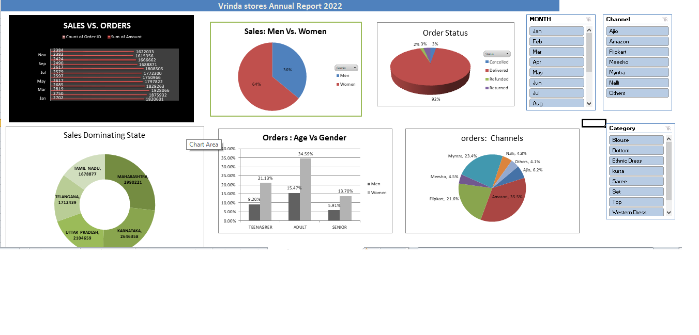

# Vrinda Store Sales Analysis Dashboard (Excel)

# Project Overview

This project focuses on analyzing sales data of Vrinda Store using Microsoft Excel and creating an interactive dashboard to generate business insights.

The dataset includes order details, sales, customer demographics, and product categories.  
Using Excel tools, I transformed raw data into meaningful visual insights.

---

# Objectives

- Analyze overall sales performance  
- Understand customer behavior  
- Identify top-performing products  
- Track monthly and category-wise sales trends  
- Build an interactive dashboard for decision-making  

---

# Dashboard Features

- Sales Trend Analysis (Monthly/Yearly)
- Category-wise Sales Distribution  
- Customer Demographics (Gender/Age)  
- Region-wise Sales Analysis  
- Top-Selling channels 

---

# Tools & Techniques Used

- Microsoft Excel  
- Pivot Tables  
- Pivot Charts  
- Slicers & Filters  
- Data Cleaning  
- Data Visualization  

---

# Key Insights

- Identified highest revenue-generating categories  
- Found top-performing regions and products  
- Analyzed customer purchasing patterns  
- Helped in data-driven decision making  

---

# How to Use

1. Open the Excel file  
2. Use slicers to filter data dynamically  
3. Explore different charts and insights from the dashboard  

---

# Learning Outcome

- Hands-on experience with Excel dashboards  
- Improved data analysis and visualization skills  
- Better understanding of business data interpretation  

---

# Dashboard Preview

---

